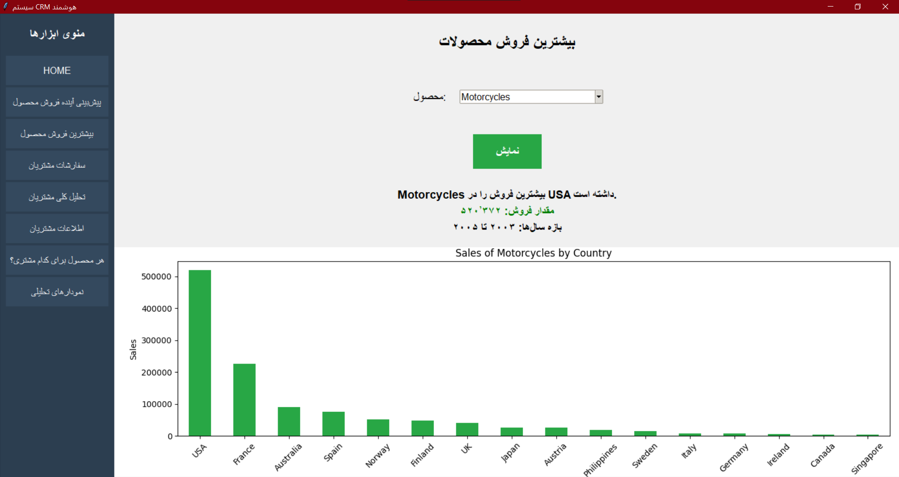
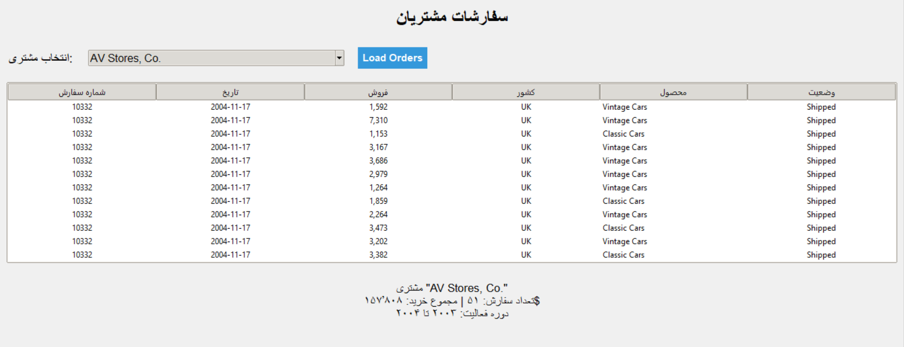
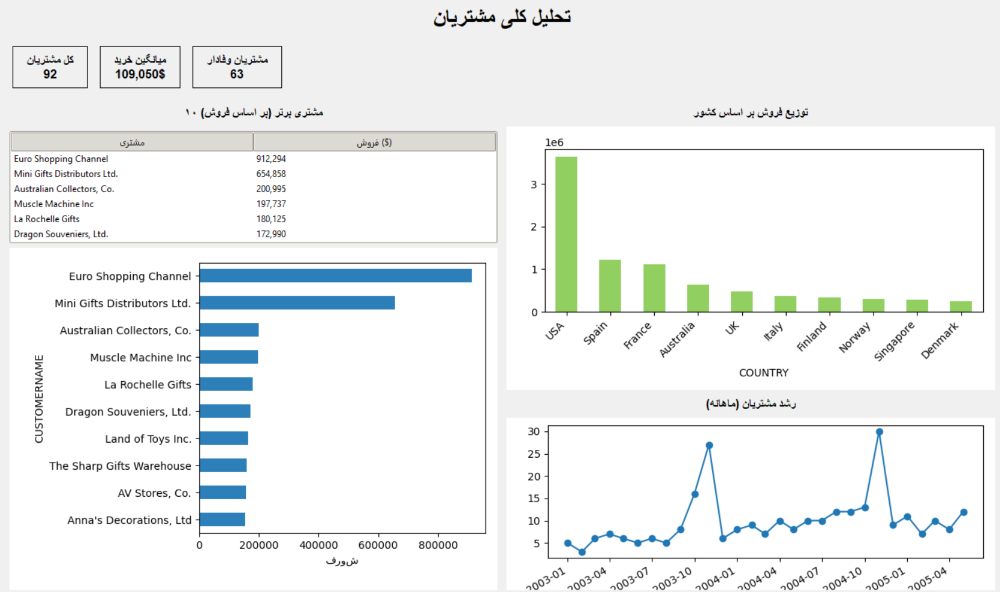

<div align="center">

# 🛒 Smart CRM System

### An Intelligent Customer Relationship Management Platform with Deep Learning-Based Sales Forecasting, Churn Prediction, and Interactive Customer Analytics

<br>

[](https://www.python.org/)
[](https://www.tensorflow.org/)
[](https://scikit-learn.org/)
[](https://docs.python.org/3/library/tkinter.html)
[](LICENSE)
[](#bilingual-support)

<br>

*A capstone-level implementation combining time-series forecasting, regression, and classification techniques within a unified, bilingual desktop application.*

</div>

---

## 📑 Table of Contents

1. [Abstract](#-abstract)
2. [Introduction](#-introduction)
3. [Screenshots](#-screenshots)
4. [Key Features](#-key-features)
5. [System Architecture](#-system-architecture)
6. [Methodology](#-methodology)
7. [Dataset](#-dataset)
8. [Installation](#-installation)
9. [Usage](#-usage)
10. [Project Structure](#-project-structure)
11. [Technologies](#-technologies)
12. [Bilingual Support](#-bilingual-support)
13. [Future Work](#-future-work)
14. [License and Attribution](#-license-and-attribution)
15. [Author](#-author)
16. [Citation](#-citation)

---

## 📄 Abstract

**Smart CRM System** is an end-to-end Customer Relationship Management platform that integrates three distinct machine learning paradigms — **Long Short-Term Memory (LSTM) networks**, **Multi-Layer Perceptrons (MLPs)**, and **Random Forest classifiers** — to deliver a comprehensive suite of analytical capabilities. The system provides eight interactive modules covering sales forecasting, customer segmentation, product–customer affinity scoring, and churn risk assessment, all unified within a fully Persian (RTL) graphical user interface.

The project demonstrates the practical application of deep learning and classical machine learning techniques to real-world business intelligence problems. All models are trained on a publicly available sales dataset and are reproducible through the provided training scripts.

---

## 🎯 Introduction

Customer Relationship Management (CRM) systems have become indispensable for modern enterprises seeking to optimize customer retention, forecast demand, and derive actionable insights from transactional data. Traditional CRM platforms often rely on static dashboards and rule-based logic; however, the integration of machine learning has enabled CRM systems to become predictive rather than merely descriptive.

This project addresses three core analytical challenges in CRM:

1. **Demand Forecasting** — Predicting future sales trends using sequential modeling
2. **Customer Churn Risk** — Identifying customers likely to disengage
3. **Product–Customer Affinity** — Scoring which customers are most likely to repurchase specific products

The result is a desktop application that serves as both a practical tool and an academic demonstration of applied machine learning.

---

## 📸 Screenshots

### Figure 1 — Main Dashboard
*The application's landing interface, displaying system status and providing navigation to eight analytical modules.*

<div align="center">



</div>

---

### Figure 2 — Customer Analytics Module
*Comprehensive customer analytics including KPI cards, Top-10 customer ranking, geographical sales distribution, and monthly customer growth trends.*

<div align="center">



</div>

---

### Figure 3 — Sales Forecasting and Analytical Charts
*LSTM-based time-series forecasting alongside advanced visualization panels covering monthly trends, market share distribution, and correlation heatmaps.*

<div align="center">



</div>

---

## ✨ Key Features

The system comprises eight distinct analytical modules:

| Module | Description |
| :--- | :--- |
| 🏠 **Home Dashboard** | System status indicators and welcome interface |
| 📈 **Sales Forecasting** | 30-day future sales prediction via LSTM neural networks |
| 🏆 **Top-Selling Products** | Product performance ranked by country and revenue |
| 📋 **Customer Orders** | Complete order history per customer with aggregated metrics |
| 📊 **Customer Analytics** | KPI dashboard, Top-10 ranking, and growth trend visualization |
| 👥 **Customer Information** | Filterable directory of all customers and loyal segments |
| 🎯 **Product–Customer Matching** | Weighted affinity scoring for repurchase likelihood |
| 📉 **Analytical Charts** | Comprehensive visual analytics including trends and correlations |
| 🔮 **Churn Prediction** | Random Forest–based identification of at-risk customers |

---

## 🏗 System Architecture

The application follows a layered architecture that separates presentation, business logic, and machine learning components:
┌──────────────────────────────────────────────────────────────┐
│ Presentation Layer (Tkinter GUI, RTL) │
│ ┌────┬──────┬──────┬──────┬──────┬──────┬──────┬──────┐ │
│ │Home│Sales │ Top │Order │Analy.│ Info │Match │Chart │ │
│ └────┴──────┴──────┴──────┴──────┴──────┴──────┴──────┘ │
└──────────────────────────┬───────────────────────────────────┘
│
┌──────────────────┼──────────────────┐
▼ ▼ ▼
┌─────────┐ ┌──────────┐ ┌───────────┐
│ LSTM │ │ MLP │ │ Random │
│Forecast │ │Regressor │ │ Forest │
└────┬────┘ └────┬─────┘ └─────┬─────┘
│ │ │
└─────────────────┼───────────────────┘
▼
┌───────────────────┐
│ Preprocessing │
│ Pipeline (CT) │
└─────────┬─────────┘
▼
┌───────────────────┐
│ Sales Dataset │
└───────────────────┘


**Architectural Principles:**

- **Separation of Concerns** — GUI, preprocessing, and model inference are decoupled
- **Reproducibility** — All models can be regenerated from raw data via training scripts
- **Extensibility** — New analytical modules can be integrated without modifying existing ones

---

## 🔬 Methodology

### Model 1 — LSTM for Sales Forecasting

The forecasting module employs a two-layer LSTM architecture designed for sequential dependency modeling in sales time series:

| Component | Configuration |
| :--- | :--- |
| Input Shape | `(30 timesteps, 1 feature)` |
| LSTM Layer 1 | 64 units, `return_sequences=True` |
| Dropout | 0.2 |
| LSTM Layer 2 | 32 units |
| Dropout | 0.2 |
| Output Layer | Dense(1) — linear activation |
| Optimizer | Adam |
| Loss | Mean Squared Error (MSE) |
| Metric | Mean Absolute Error (MAE) |

**Training Configuration:** 50 epochs, batch size 16, early stopping with patience of 10, model checkpointing on validation loss.

### Model 2 — MLP for Sales Value Regression

A deep feedforward network with regularization techniques to prevent overfitting:

| Layer | Configuration |
| :--- | :--- |
| Dense 1 | 256 units + LeakyReLU(0.1) + BatchNorm + Dropout(0.3) |
| Dense 2 | 128 units + LeakyReLU(0.1) + BatchNorm + Dropout(0.2) |
| Dense 3 | 64 units + LeakyReLU(0.1) + Dropout(0.1) |
| Output | Dense(1) — linear activation |

### Model 3 — Random Forest for Churn Classification

A classical ensemble classifier providing interpretable and robust churn predictions:

| Parameter | Value |
| :--- | :--- |
| Estimators | 200 |
| Random State | 42 |
| Preprocessing | StandardScaler + OneHotEncoder |

---

## 📊 Dataset

- **Name:** Sample Sales Data
- **Source:** [Kaggle — Sample Sales Data](https://www.kaggle.com/datasets/kyanyoga/sample-sales-data)
- **Volume:** Approximately 2,800 transactional records
- **Features:** Product line, quantity ordered, price each, order line number, MSRP, product code, country, territory, deal size, order dates
- **Target Variables:**
  - `SALES` — for regression tasks
  - `Churn` — for binary classification

---

## 🚀 Installation

### Prerequisites

- Python 3.9 or higher
- pip package manager
- (Recommended) A virtual environment

### Step 1 — Clone the repository

```bash
git clone https://github.com/ahlam-ghasemiyan/smart-crm-system.git
cd smart-crm-system
Step 2 — Create and activate a virtual environment
bash
# Windows
python -m venv venv
venv\Scripts\activate

# macOS / Linux
python3 -m venv venv
source venv/bin/activate
Step 3 — Install dependencies
bash
pip install -r requirements.txt
🖥 Usage
Step 1 — Train the machine learning models
Execute the training scripts in the following order:

bash
# Train the MLP sales regression model
python src/train_optimized.py

# Train the LSTM forecasting model
python src/train_lstm.py

# Train the churn classification model
python src/train_churn_model.py
Note: The LSTM training process may take several minutes depending on hardware. All trained models are saved to the models/ directory.

Step 2 — Launch the application
bash
python src/crm_app.py
The Persian GUI will open with full navigation to all eight analytical modules.

📁 Project Structure
text
smart-crm-system/
├── src/
│   ├── crm_app.py                # Main Tkinter application
│   ├── train_optimized.py        # MLP training script
│   ├── train_lstm.py             # LSTM training script
│   ├── train_churn_model.py      # Random Forest churn classifier
│   └── train_hyperopt.py         # Hyperparameter tuning (optional)
├── data/
│   └── sales_data_sample.csv     # Source dataset
├── models/                       # Trained models (gitignored)
│   └── .gitkeep
├── assets/
│   ├── crm1.png
│   ├── crm2.png
│   └── crm3.png
├── requirements.txt
├── LICENSE
├── NOTICE
├── .gitignore
└── README.md
🛠 Technologies
Layer	Technologies
GUI Framework	Tkinter
Deep Learning	TensorFlow, Keras
Machine Learning	scikit-learn
Data Manipulation	pandas, NumPy
Visualization	Matplotlib, Seaborn
Persistence	joblib, HDF5
🌍 Bilingual Support
This project is designed from the ground up as a bilingual application:

Aspect	Language
Graphical User Interface	Persian (RTL layout)
Code Comments	English (with Persian annotations where domain-specific)
Documentation	English
Variable Naming	English
Contributions to expand the interface into additional languages are welcome.

🔭 Future Work
The following enhancements are planned or open for contribution:

□ Web deployment — Migration to Streamlit or FastAPI
□ Containerization — Docker support for reproducible environments
□ Testing — Comprehensive unit and integration test suite via pytest
□ Explainability — Integration of SHAP values for model interpretability
□ Internationalization — Full English-language GUI with locale switching
□ Responsive design — Mobile-friendly interface
□ Cloud deployment — Streamlit Cloud or Hugging Face Spaces
□ Real-world datasets — Replacement of sample data with production-scale datasets
⚖️ License and Attribution
License
This project is distributed under the MIT License. See the LICENSE file for the full legal text.

Attribution Requirement
While the MIT License grants broad permissions for use, modification, and distribution, explicit attribution to the original author is strictly required. Any use of this software, in whole or in part, must include the following notice:

text
This project is based on "Smart CRM System" by Ahlam Ghasemiyan.
Original repository: https://github.com/ahlam-ghasemiyan/smart-crm-system
Prohibited Uses
The following actions are not permitted under the terms of this project:

Removing, obscuring, or modifying the author's name from the source code

Claiming authorship of this software or any substantial portion thereof

Distributing this software without the attribution notice above

Selling this software as a standalone commercial product without prior written consent

Removing or altering the LICENSE or NOTICE files from any distribution

Commercial Licensing
For commercial use without attribution, or for integration into proprietary software, please contact the author directly to obtain a separate commercial license.

Legal Enforcement
Violations of these terms constitute copyright infringement and may result in DMCA takedown requests, public disclosure of the violation, and/or legal action where applicable.

See the NOTICE file for the complete attribution and enforcement policy.

👩‍💻 Author
<div align="center">
Ahlam Ghasemiyan
Artificial Intelligence and Machine Learning Developer
https://github.com/ahlam-ghasemiyan
</div>
